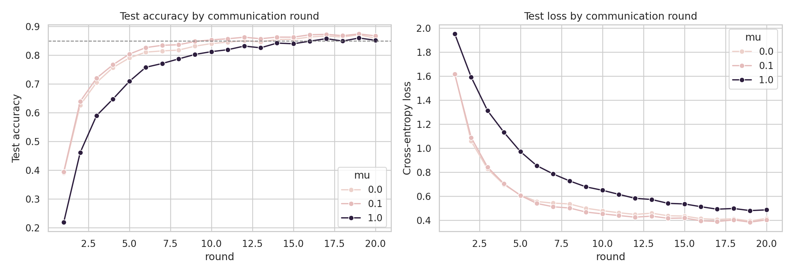
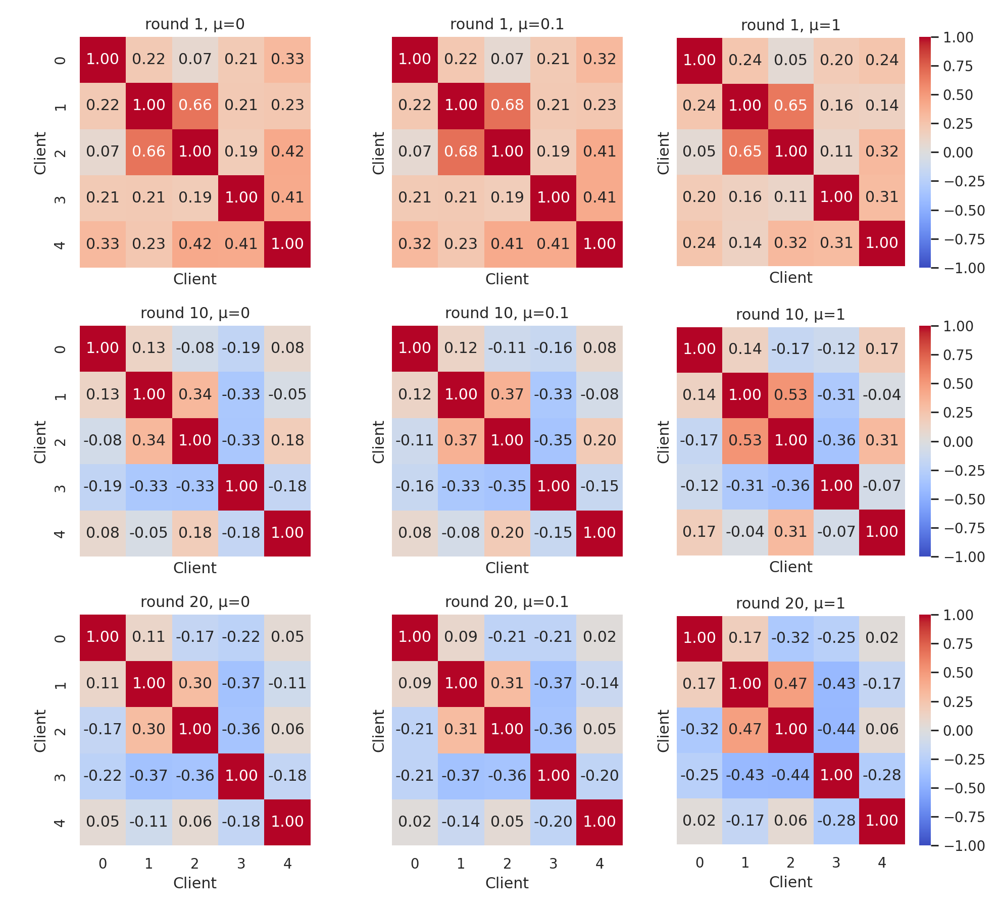
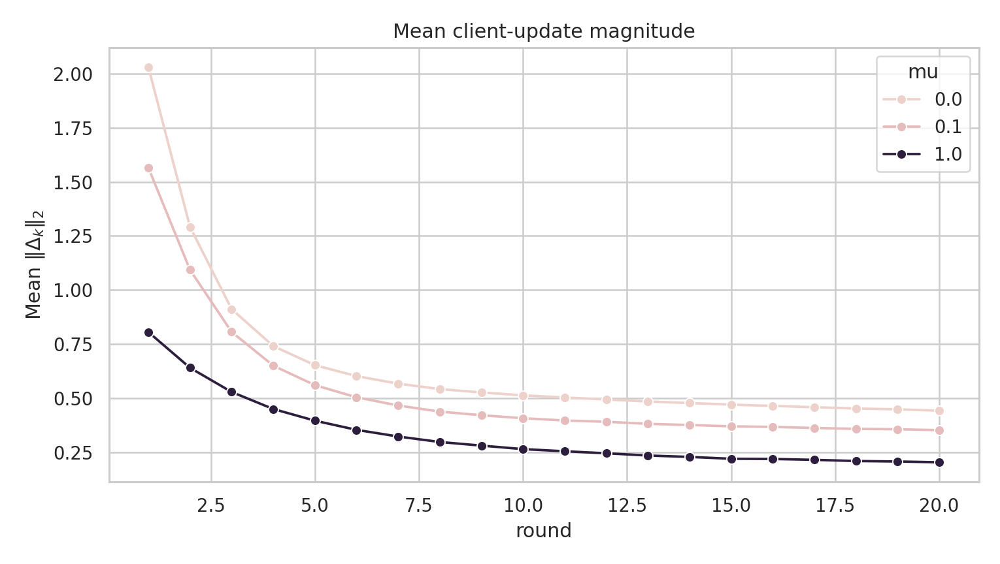

# Federated Learning Under Client Heterogeneity

[](https://pytorch.org/)
[](http://yann.lecun.com/exdb/mnist/)
[](#reproducing-the-results)

A from-scratch PyTorch study of how **statistical heterogeneity changes federated optimization**—from FedAvg baselines to FedProx and client-update geometry.

The central question is:

> Does proximal regularization improve federated optimization by shrinking client updates, aligning their directions, or both?

This is an experimental research repository, not a production FL framework. Every comparison reuses the same model initialization and, where applicable, the same saved client partition.

## Key findings

Under a strongly heterogeneous Dirichlet partition (`alpha = 0.1`) with 5 clients, 5 local epochs, and 20 communication rounds:

- Moderate FedProx (`mu = 0.1`) reached 85% test accuracy in **10 rounds**, compared with **12 rounds** for FedAvg (`mu = 0`).
- Mean client-update magnitude fell by **18.7%** at `mu = 0.1` and **49.6%** at `mu = 1.0`, relative to FedAvg.
- Directional behavior was not explained by magnitude alone. Mean pairwise alignment increased overall with `mu`, but the effect varied across rounds and client pairs.
- Leave-one-out alignment was negative for **72%**, **67%**, and **56%** of client-round observations at `mu = 0`, `0.1`, and `1.0`, respectively.
- An exploratory intervention that reduced the influence of one post-hoc identified client reached **88.0% best accuracy**, versus **87.1%** with its original FedAvg weight.

These are **single-seed observations**, not statistically significant or causal conclusions. The client-scaling result is an oracle-style diagnostic, not a deployable aggregation algorithm.



## What is client-update geometry?

At round `t`, client `k` starts from the global model `w_t` and returns a locally trained model `w_k`. Its update is

```text
Delta_k = w_k - w_t
```

This project measures three complementary properties:

| Diagnostic | Definition | Question |
|---|---|---|
| Update magnitude | `||Delta_k||_2` | How far did the client move? |
| Pairwise alignment | `cos(Delta_i, Delta_j)` | Do two clients move in similar directions? |
| Aggregate alignment | `cos(Delta_k, sum_j p_j Delta_j)` | Does a client agree with the server update? |

The leave-one-out variant compares each client with the aggregate of **the other clients only**. This removes the client's mechanical contribution to the direction against which it is evaluated.



## Experiment map

The notebooks form one controlled research sequence:

| Experiment | Question | Notebook |
|---|---|---|
| 01. IID FedAvg | How do local epochs trade computation for communication? | [`01_fedavg_from_scratch.ipynb`](notebooks/01_fedavg_from_scratch.ipynb) |
| 02. Shard non-IID | How does severe label concentration change FedAvg? | [`02_fedavg_shard_noniid.ipynb`](notebooks/02_fedavg_shard_noniid.ipynb) |
| 03. Dirichlet non-IID | How does performance change as heterogeneity increases? | [`03_fedavg_dirichlet_noniid.ipynb`](notebooks/03_fedavg_dirichlet_noniid.ipynb) |
| 04. FedProx | Can proximal regularization improve round-wise convergence? | [`04_fedprox_under_heterogeneity.ipynb`](notebooks/04_fedprox_under_heterogeneity.ipynb) |
| 05. Update geometry | How does `mu` affect update magnitude and direction? | **[`05_client_update_geometry.ipynb`](notebooks/05_client_update_geometry.ipynb)** |

If you only open one notebook, start with **Experiment 05**. It contains the main research question, diagnostics, results, limitations, and reproducibility appendix.

## Controlled setup

| Setting | Value |
|---|---|
| Dataset | MNIST |
| Clients | 5; full participation |
| Model | MLP: 784 -> 128 -> 10 |
| Optimizer | SGD, learning rate 0.01 |
| Batch size | 64 |
| Communication rounds | 20 |
| Main geometry setting | Dirichlet `alpha = 0.1`, `E = 5` |
| FedProx coefficients | `mu in {0, 0.1, 1.0}` |
| Seed | 42 |

The `alpha = 0.1` split contains both label concentration and quantity imbalance. It is therefore described as **Dirichlet-induced statistical heterogeneity**, not pure label skew.

## Earlier results

### IID local-epoch sweep

| Local epochs `E` | Final accuracy |
|---:|---:|
| 1 | 92.33% |
| 5 | 96.29% |
| 10 | 97.25% |

Increasing local computation improved progress per communication round under IID data.

### Pathological shard non-IID

| Local epochs `E` | Final accuracy |
|---:|---:|
| 1 | 78.84% |
| 5 | 79.98% |
| 10 | 82.43% |

Local epochs still helped per round, but the improvement was much weaker than under IID data.

### FedProx under strong heterogeneity

Moderate regularization improved the convergence trajectory, while `mu = 1` suppressed useful local learning. Final accuracy alone hid part of this effect, so Experiment 05 added round-wise geometric diagnostics.



## Repository structure

```text
.
├── notebooks/                     # Five experiments in research order
├── src/
│   ├── aggregate.py               # Sample-size-weighted server aggregation
│   ├── data.py                    # IID, shard, and Dirichlet partitioning
│   ├── diagnostics.py             # Vectorization, norms, cosine similarity
│   ├── fedprox.py                 # FedProx local objective and training
│   ├── models.py                  # SimpleMLP
│   └── training.py                # Local training and evaluation utilities
└── results/
    ├── iid_baseline/
    ├── shard_noniid/
    ├── dirichlet_noniid/
    ├── fedprox/
    └── client_update_geometry/    # Raw diagnostics, summaries, and figures
```

See [`notebooks/README.md`](notebooks/README.md) for the experiment guide and [`results/client_update_geometry/README.md`](results/client_update_geometry/README.md) for the diagnostic data dictionary.

## Reproducing the results

```bash
git clone https://github.com/khanhhuyenpham/federated-learning-under-heterogeneity.git
cd federated-learning-under-heterogeneity

python -m venv .venv
# Windows: .venv\Scripts\activate
# macOS/Linux: source .venv/bin/activate

pip install -r requirements.txt
jupyter lab
```

Run the notebooks in numerical order. The completed CSV results, plots, initial weights, and important client partitions are checked into `results/`, so the analysis can be inspected without repeating the longest training runs.

Full sweeps are disabled by default in the polished notebooks where rerunning is expensive. Enable the corresponding run flag only when intentionally reproducing an experiment.

## Experimental discipline

Controlled comparisons keep the following fixed unless they are the independent variable:

- initial global weights;
- client partition;
- model architecture;
- optimizer, learning rate, and batch size;
- communication rounds and local epochs;
- random seed.

The implementation also verifies that FedProx with `mu = 0` reduces to the FedAvg local update under controlled minibatch ordering, and that the vector-averaged update matches parameter-wise server aggregation within floating-point tolerance.

## Limitations

- MNIST and a small MLP do not establish generality across tasks or architectures.
- The main results use 5 fully participating clients and one seed.
- Heterogeneity combines label concentration and unequal client sizes.
- Cosine similarity is descriptive; association with accuracy does not prove causality.
- The client-scaling experiment selects its target after inspecting the diagnostics.

The next research step is replication across seeds, heterogeneity levels, client counts, and at least one harder dataset before proposing an adaptive aggregation rule.

## References

- McMahan et al., [Communication-Efficient Learning of Deep Networks from Decentralized Data](https://arxiv.org/abs/1602.05629), AISTATS 2017.
- Li et al., [Federated Optimization in Heterogeneous Networks](https://arxiv.org/abs/1812.06127), MLSys 2020.

## Project status

The five-experiment study is complete as a **single-seed research prototype**. The repository is now being extended toward multi-seed validation and a more general investigation of whether client-update geometry can support principled aggregation decisions.
