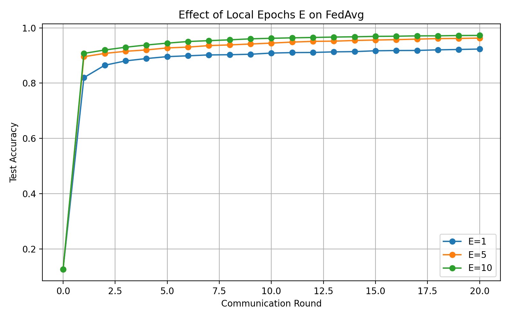
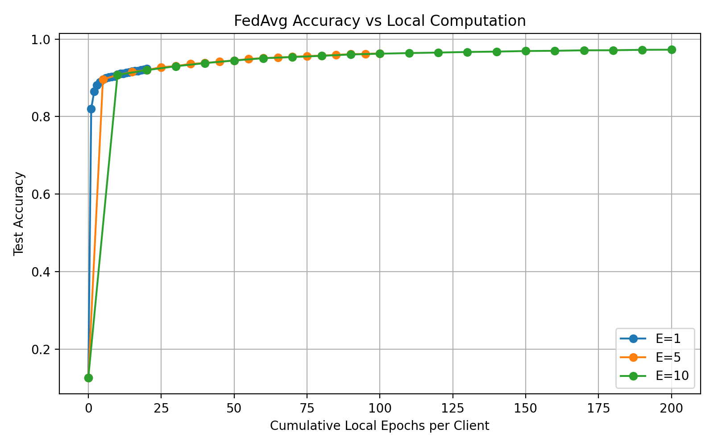

# Federated Learning Under Client Heterogeneity

A from-scratch PyTorch study of federated optimization, starting with **Federated Averaging (FedAvg)** and progressively moving toward heterogeneous-client and drift-aware experiments.

The goal of this repository is not to provide a production FL framework. It is an experimental codebase for understanding *why* federated algorithms behave differently as client data and local computation change.

## Current status

- [x] FedAvg implemented from scratch
- [x] 5-client IID MNIST partition
- [x] Weighted server aggregation
- [x] Full communication-round training loop
- [x] Controlled local-epoch sweep: `E = {1, 5, 10}`
- [x] Communication-vs-computation baseline analysis
- [ ] Controlled non-IID partition
- [ ] Client-update drift / cosine-similarity analysis
- [ ] FedProx
- [ ] FedAvg vs FedProx under heterogeneity
- [ ] Spatiotemporal mobility experiments

## IID FedAvg baseline

**Setup**

| Setting | Value |
|---|---|
| Dataset | MNIST |
| Clients | 5 |
| Partition | IID |
| Client participation | 100% (`C = 1`) |
| Model | MLP: 784 → 128 → 10 |
| Optimizer | SGD |
| Batch size | 64 |
| Learning rate | 0.01 |
| Communication rounds | 20 |
| Local epochs | `E ∈ {1, 5, 10}` |
| Seed | 42 |

**Results**

| E | Final accuracy | Rounds to 90% | Local epochs to 90% | Rounds to 95% | Local epochs to 95% |
|---:|---:|---:|---:|---:|---:|
| 1 | 92.33% | 7 | 7 | — | — |
| 5 | 96.29% | 2 | 10 | 12 | 60 |
| 10 | 97.25% | 1 | 10 | 6 | 60 |

The IID baseline shows the classic FedAvg trade-off: larger `E` improves convergence **per communication round**, but performs more client-side computation. `E=5` and `E=10` both required about 60 cumulative local epochs per client to reach 95% accuracy; `E=10` reached that target in half as many communication rounds.





## Repository structure

```text
federated-learning-under-heterogeneity/
├── README.md
├── .gitignore
├── requirements.txt
├── notebooks/
│   └── 01_fedavg_from_scratch.ipynb
└── results/
    └── iid_baseline/
        ├── config.json
        ├── summary.csv
        ├── fedavg_iid_E1_history.csv
        ├── fedavg_iid_E5_history.csv
        ├── fedavg_iid_E10_history.csv
        ├── initial_model.pt
        ├── client_indices.pt
        ├── fedavg_iid_E10_final.pt
        ├── accuracy_vs_round.png
        ├── accuracy_vs_local_epochs.png
        └── loss_vs_round.png
```

The saved baseline now includes the exact initial weights, IID client split, original per-round CSV histories, and the final `E=10` checkpoint from the completed Colab run.

## Reproducing the notebook

Install dependencies:

```bash
pip install -r requirements.txt
```

Open `notebooks/01_fedavg_from_scratch.ipynb`.

The full `E={1,5,10}` sweep is disabled by default because it is expensive on CPU. The completed baseline metrics are checked into `results/iid_baseline/`. Set `RUN_FULL_SWEEP = True` only when intentionally reproducing the full run.

## Experimental discipline

Comparisons should keep the following fixed unless they are the variable under study:

- initial global weights,
- client partition,
- model architecture,
- optimizer and learning rate,
- batch size,
- communication rounds,
- random seed(s).

The current baseline uses one seed, so it should be treated as a development baseline rather than a statistically robust final result.

## Next experiment

The next notebook will introduce controlled **non-IID client data** and ask how increasing local epochs changes client update behavior. After that, FedProx can be compared against FedAvg using the same initialization and client partition.
