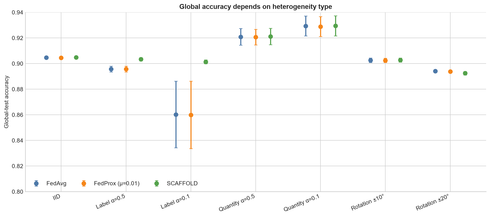

# Federated Optimization Under Statistical Heterogeneity

I built this project to understand what actually goes wrong when federated
clients do not see the same data.

At first, my question was fairly simple: if non-IID clients pull a global model
in conflicting directions, can FedProx help by preventing each local model from
moving too far? Implementing FedProx led me to inspect the updates themselves—not
only their final accuracy, but also their magnitude, pairwise similarity, and
alignment with the update produced by the other clients.

The results changed the direction of the project. FedProx reliably made local
updates smaller, yet smaller updates did not reliably produce a better global
model. I then implemented SCAFFOLD to test a different idea: correct systematic
client drift instead of merely limiting local movement. Finally, I expanded the
study beyond one severe label-skew setting and asked whether the same conclusions
survive different types and severities of heterogeneity.

The final study compares **FedAvg, FedProx, and SCAFFOLD across 63 matched runs**
on MNIST. It covers label imbalance, client-size imbalance, and client-specific
rotation shifts over seeds 42, 43, and 44. The federated optimization logic is
implemented directly in PyTorch, without Flower, TensorFlow Federated, or another
federated learning framework.

## The question I ended up asking

> When does correcting client drift improve federated learning—and when does the
> type of heterogeneity matter more than the choice of optimizer?

I use the benchmark to examine four related questions:

1. Do FedAvg, FedProx, and SCAFFOLD react differently to label, quantity, and
   feature heterogeneity?
2. Does increasing the severity of a shift change the method ranking?
3. Are the conclusions stable across matched random seeds?
4. Do clean global accuracy, client-local accuracy, worst-client accuracy,
   convergence, and runtime tell the same story?

## Final benchmark

The benchmark contains seven conditions per seed:

| Heterogeneity | Conditions | What changes between clients |
|---|---|---|
| Control | IID | Neither label mix, sample count, nor image orientation is intentionally shifted |
| Label skew | Dirichlet `alpha = 0.5` and `0.1` | Label proportions, while client sizes remain balanced |
| Quantity skew | Dirichlet `alpha = 0.5` and `0.1` | Client sample counts, with at least 100 examples per client |
| Rotation shift | `±10°` and `±20°` | A fixed client-specific rotation applied to train, validation, and local-test images |

For each condition, all three algorithms receive the same client partition,
train/validation/test split, initial model weights, and seeded minibatch schedule.
Only the heterogeneity condition, seed, and optimization method change.

This gives:

```text
7 conditions x 3 seeds x 3 algorithms = 63 runs
```

### Clean global test accuracy

The table below reports mean accuracy ± sample standard deviation
across the three seeds on the official, untransformed MNIST test set.

| Condition | FedAvg | FedProx (`mu = 0.01`) | SCAFFOLD |
|---|---:|---:|---:|
| IID | 90.47 ± 0.09% | 90.46 ± 0.08% | 90.48 ± 0.08% |
| Label skew, `alpha = 0.5` | 89.57 ± 0.22% | 89.57 ± 0.22% | **90.34 ± 0.13%** |
| Label skew, `alpha = 0.1` | 86.03 ± 2.61% | 85.99 ± 2.64% | **90.14 ± 0.15%** |
| Quantity skew, `alpha = 0.5` | 92.09 ± 0.65% | 92.07 ± 0.61% | 92.12 ± 0.64% |
| Quantity skew, `alpha = 0.1` | 92.94 ± 0.78% | 92.89 ± 0.77% | 92.95 ± 0.78% |
| Rotation shift, `±10°` | 90.26 ± 0.17% | 90.25 ± 0.17% | 90.27 ± 0.16% |
| Rotation shift, `±20°` | **89.42 ± 0.06%** | 89.39 ± 0.08% | 89.25 ± 0.13% |



## What I learned

### 1. SCAFFOLD's advantage was specific, not universal

The clearest separation appeared under label skew. At `alpha = 0.1`, SCAFFOLD
improved mean clean global accuracy by **4.11 percentage points** over FedAvg and
reduced the across-seed standard deviation from **2.61 to 0.15 percentage
points**. Its mean worst-client local accuracy was also substantially higher:
87.42% versus 76.14% for FedAvg.

This pattern was already visible at the milder `alpha = 0.5`, but the gap became
larger as the realized label imbalance increased. That is consistent with
SCAFFOLD helping when clients repeatedly optimize toward different label-driven
objectives.

Across all 21 matched condition-seed pairs, SCAFFOLD beat FedAvg on clean global
accuracy 14 times, tied twice, and lost five times. The average paired difference
was +0.68 percentage points—but that average hides an important fact: most of
the gain came from label skew.

The wall-clock difference was small in this single-machine simulation: mean
runtime per run was about 223 seconds for FedAvg, 223 seconds for FedProx, and
226 seconds for SCAFFOLD. That should not be mistaken for equal communication
cost. Under the full-vector accounting used here, SCAFFOLD transmits both model
and control vectors, doubling the modeled traffic from 4.07 MB to 8.14 MB per
round and maintaining 2.44 MB of control state across the server and five
clients.

### 2. Quantity imbalance alone did not create the same optimization problem

The severe quantity-skew setting was genuinely imbalanced: its mean realized
client-size coefficient of variation was 1.48, and client sizes ranged from the
100-example minimum to more than 46,000 examples in some seeded partitions.
Nevertheless, the realized label-distribution shift remained small, with mean
label total-variation distance around 0.054.

Under full participation and sample-size-weighted aggregation, all three methods
therefore behaved almost identically. A small client and a large client saw
different amounts of data, but not strongly conflicting label objectives. This
was a useful correction to my initial intuition: **more imbalance does not
automatically mean more client drift**.

### 3. The evaluation distribution can change the conclusion

Under the stronger `±20°` rotation shift, SCAFFOLD was slightly worse on
the clean global MNIST test set than FedAvg (89.25% versus 89.42%). On the
rotated client-local test sets, however, it achieved better weighted accuracy
(85.94% versus 85.64%) and better worst-client accuracy (82.42% versus 81.72%).

Neither number is the single “correct” answer. The clean test measures transfer
back to the original MNIST distribution; the local tests measure service to the
actual shifted client environments. Reporting both exposed a trade-off that one
aggregate score would have hidden.

### 4. FedProx was not a free improvement over FedAvg

Before the main benchmark, I ran a prespecified pilot under severe balanced
label skew using `mu` in `{0.01, 0.1, 1.0}`. The selection rule used the final
five-round validation mean across seeds. Candidates within 0.25 percentage
points of the best mean were compared by across-seed stability, then by the
smaller `mu`. This rule selected `mu = 0.01`:

| `mu` | Mean tail validation accuracy | Across-seed SD |
|---:|---:|---:|
| **0.01** | **84.50%** | **2.07%** |
| 0.1 | 84.30% | 2.11% |
| 1.0 | 82.25% | 2.33% |

After fixing that value before the main comparison, FedProx remained almost
indistinguishable from FedAvg. Its average paired clean-test difference was
-0.02 percentage points across the 21 condition-seed pairs. Stronger proximal
regularization had already performed worse in the pilot.

My conclusion is not that FedProx is ineffective in general. In this protocol,
one local epoch already limits client drift, so a small proximal term changes
little while a large one can suppress useful learning.

### 5. Raw parameters are not enough to describe heterogeneity

The same Dirichlet `alpha` can govern different random objects. In label skew it
changes class proportions; in quantity skew it changes client sizes. I therefore
store realized descriptors with every run:

| Condition | Quantity CV | Mean label TVD | Rotation SD |
|---|---:|---:|---:|
| IID | 0.000 | 0.010 | 0.00 degrees |
| Label `alpha = 0.5` | 0.000 | 0.373 | 0.00 degrees |
| Label `alpha = 0.1` | 0.000 | 0.514 | 0.00 degrees |
| Quantity `alpha = 0.5` | 1.030 | 0.029 | 0.00 degrees |
| Quantity `alpha = 0.1` | 1.481 | 0.054 | 0.00 degrees |
| Rotation `±10°` | 0.000 | 0.010 | 7.07° |
| Rotation `±20°` | 0.000 | 0.010 | 14.14° |

These are averages across the three seeded conditions. They make it possible to
interpret what each synthetic setting actually produced, rather than treating
its configuration label as the evidence.

## FedProx and SCAFFOLD in plain language

FedProx adds a proximal penalty to each client's local objective:

$$
F_i(w) + \frac{\mu}{2}\lVert w-w_t\rVert_2^2.
$$

The penalty discourages the local model from moving too far from the global
model `w_t` received at the start of the round.

SCAFFOLD instead corrects the local gradient:

$$
g_i^{\mathrm{corrected}} = g_i + c - c_i,
$$

where `c` is the server control variate and `c_i` is the persistent control
variate for client `i`. The control states estimate and compensate for
client-specific drift across rounds.

The distinction that helped me reason about them is:

> FedProx gives clients a speed limit. SCAFFOLD helps calibrate their compasses.

The implementation uses full participation, sample-size-weighted model
aggregation, and sample-size-weighted control aggregation. A more detailed
derivation is available in [`docs/methodology.md`](docs/methodology.md).

## Experimental protocol

| Setting | Value |
|---|---|
| Dataset | MNIST |
| Clients | 5, with full participation |
| Client split | 80% train, 10% validation, 10% local test |
| Clean evaluation | Official MNIST test set |
| Model | MLP: `784 -> 128 -> 10`, ReLU |
| Optimizer | SGD |
| Learning rate | 0.01 |
| Batch size | 64 |
| Local epochs | 1 |
| Communication rounds | 20 |
| Seeds | 42, 43, 44 |
| FedProx coefficient | `mu = 0.01`, selected before the main benchmark |
| Aggregation | Sample-size weighted |

The MNIST training collection is first partitioned into client worlds. Each
client's assigned indices are then split into training, validation, and local
test subsets. Rotation transforms, when present, are applied consistently to
all three local splits. The official MNIST test set stays clean and shared.

The seed—not an individual client or communication round—is the experimental
unit. Client-round observations are useful diagnostics, but I do not treat them
as independent replicates.

## What is measured

Accuracy alone cannot show whether a method serves every client or how its
updates interact. The benchmark therefore records several views:

| Output | Question it answers |
|---|---|
| Clean global accuracy | Does the final model generalize to the original MNIST distribution? |
| Local weighted accuracy | How well does it serve all held-out client examples collectively? |
| Mean client accuracy | What happens when every client receives equal weight? |
| Worst-client accuracy | How well is the least-served client doing? |
| Validation trajectory | How quickly and steadily does training progress? |
| Runtime | What wall-clock cost is observed under the matched runner? |

For each client update `Delta_i = w_i - w_t`, I also record:

- update and relative-update magnitude;
- pairwise cosine similarity;
- alignment with the aggregate update;
- leave-one-out alignment with the weighted update of all other clients.

These diagnostics help describe the optimization mechanism. They do not, by
themselves, prove that update alignment causes an accuracy change.

## How the project developed

The notebooks are intentionally kept in research order. The early notebooks
show the implementation and the questions that led to the final protocol;
Notebooks 08–10 contain the coefficient selection, balanced benchmark, and
final analysis.

| Notebook | Role in the project |
|---|---|
| [`01_fedavg_from_scratch.ipynb`](notebooks/01_fedavg_from_scratch.ipynb) | Build FedAvg under IID data |
| [`02_fedavg_shard_noniid.ipynb`](notebooks/02_fedavg_shard_noniid.ipynb) | Introduce pathological shard heterogeneity |
| [`03_fedavg_dirichlet_noniid.ipynb`](notebooks/03_fedavg_dirichlet_noniid.ipynb) | Explore Dirichlet label partitions |
| [`04_fedprox_under_heterogeneity.ipynb`](notebooks/04_fedprox_under_heterogeneity.ipynb) | Implement FedProx and run an initial `mu` sweep |
| [`05_client_update_geometry.ipynb`](notebooks/05_client_update_geometry.ipynb) | Move from final accuracy to client-update geometry |
| [`06_multiseed_fedprox_robustness.ipynb`](notebooks/06_multiseed_fedprox_robustness.ipynb) | Test whether the FedProx observations replicate across seeds |
| [`07_scaffold_under_heterogeneity.ipynb`](notebooks/07_scaffold_under_heterogeneity.ipynb) | Implement SCAFFOLD and compare drift correction under severe label skew |
| [`08_fedprox_mu_selection.ipynb`](notebooks/08_fedprox_mu_selection.ipynb) | Select one FedProx coefficient using a prespecified pilot rule |
| [`09_balanced_heterogeneity_benchmark.ipynb`](notebooks/09_balanced_heterogeneity_benchmark.ipynb) | Run the restart-safe 63-run benchmark |
| [`10_balanced_benchmark_analysis.ipynb`](notebooks/10_balanced_benchmark_analysis.ipynb) | Audit, summarize, visualize, and interpret the final results |

If you want the shortest path through the project, read Notebook 08 for the
selection protocol, Notebook 09 for the execution contract, and Notebook 10
for the findings. Notebooks 05–07 explain why I designed the final benchmark
the way I did.

## Repository structure

```text
.
├── src/
│   ├── aggregate.py                 # Weighted model aggregation
│   ├── data.py                      # Client splits and deterministic loaders
│   ├── diagnostics.py               # Client-update geometry
│   ├── experiment.py                # FedAvg/FedProx training loop
│   ├── scaffold.py                  # SCAFFOLD and control variates
│   ├── heterogeneity.py             # Unified heterogeneity configuration
│   ├── heterogeneity_metrics.py     # Realized severity measurements
│   ├── condition_artifacts.py       # Matched partitions, splits, and loaders
│   ├── benchmark_runner.py          # One algorithm-condition execution
│   ├── benchmark_suite.py           # Matched multi-condition suite
│   ├── benchmark_storage.py         # Restart-safe per-run persistence
│   ├── benchmark_protocol.py        # Frozen pilot and main-study matrix
│   └── fedprox_selection.py         # Prespecified coefficient selection
├── notebooks/                       # Ten notebooks in research order
├── results/
│   ├── balanced_benchmark_v1/
│   │   ├── combined/                # Compact canonical CSV files
│   │   └── analysis/                # Final tables and figures
│   └── ...                          # Earlier exploratory artifacts
├── docs/methodology.md
└── tests/                            # Deterministic unit and integration tests
```

See [`notebooks/README.md`](notebooks/README.md) for the notebook execution map
and [`results/README.md`](results/README.md) for the artifact layout.

## Inspecting the results

The compact final evidence is committed under
[`results/balanced_benchmark_v1/`](results/balanced_benchmark_v1/). The most
useful entry points are:

- [`combined/summary.csv`](results/balanced_benchmark_v1/combined/summary.csv):
  one row per run;
- [`combined/validation_by_round.csv`](results/balanced_benchmark_v1/combined/validation_by_round.csv):
  convergence histories;
- [`combined/local_test_by_client.csv`](results/balanced_benchmark_v1/combined/local_test_by_client.csv):
  final client-level evaluation;
- [`analysis/tables/`](results/balanced_benchmark_v1/analysis/tables/): derived
  comparisons used above;
- [`analysis/figures/`](results/balanced_benchmark_v1/analysis/figures/): final
  visualizations.

Notebook 10 performs its analysis from these CSV files and does not require the
individual model-state files. The complete restartable run directories are kept
in the release archive `balanced_benchmark_v1_complete.zip`; the FedProx pilot
is preserved separately as `fedprox_mu_pilot_v1_complete.zip`.

## Installation and checks

```bash
git clone https://github.com/khanhhuyenpham/federated-learning-under-heterogeneity.git
cd federated-learning-under-heterogeneity

python -m venv .venv

# Windows PowerShell
.venv\Scripts\Activate.ps1

# macOS/Linux
source .venv/bin/activate

python -m pip install --upgrade pip
python -m pip install -r requirements.txt
python -m pip install -r requirements-dev.txt
python -m pytest tests -q
jupyter lab
```

The full benchmark was run on Kaggle with one NVIDIA T4. Per-run completion
markers and condition-specific storage keys allow interrupted suites to resume
without repeating completed conditions. The saved CSVs are sufficient to inspect
the conclusions without rerunning the GPU experiments.

The test suite checks, among other things:

- partition validity, reproducibility, and full coverage;
- propagation of client-specific transforms to every local split;
- equality of client IDs across train, validation, and local-test loaders;
- matched initial weights and condition artifacts across algorithms;
- FedAvg, FedProx, and SCAFFOLD parameter contracts;
- SCAFFOLD control-state and aggregation invariants;
- benchmark key/result consistency and restart-safe storage;
- coefficient-selection behavior and final-result schemas.

## Limitations

- The study uses MNIST and a small MLP. The rankings may change with harder
  datasets, convolutional models, or pretrained representations.
- Three seeds are enough to expose instability, but not enough for strong
  inferential claims.
- The benchmark uses five fully participating clients, one local epoch, and a
  fixed 20-round communication budget. Partial participation and more local
  work may create different drift behavior.
- Only one FedProx coefficient is carried into the main benchmark. Its selection
  is documented, but it is not a claim that `mu = 0.01` transfers to other
  datasets or protocols.
- The heterogeneity mechanisms are controlled simulations. They do not capture
  device availability, network latency, privacy mechanisms, or all forms of
  real-world distribution shift.
- Worst-client accuracy is based on five clients and can be sensitive to the
  realized partition.
- Runtime is measured consistently within this benchmark environment, but it is
  not a complete model of production communication or systems cost.
- Update geometry is descriptive. The experiments support a mechanism-level
  interpretation, not a causal proof.

The central conclusion is deliberately narrower than “one algorithm wins.” In
this study, **SCAFFOLD was most useful when heterogeneity created persistent
label-driven disagreement**. It offered little advantage when clients mainly
differed in sample count, and feature shift introduced a trade-off between clean
global and client-local evaluation. FedProx changed update behavior in the
earlier experiments, but the selected proximal strength did not improve the
final balanced benchmark.

That is the result I find most useful: the right federated optimizer depends not
only on how heterogeneous the clients are, but on *how* they are heterogeneous
and on which population the final model is meant to serve.

## What I would test next

The next step would be to keep the same matched benchmark design while changing
one assumption at a time: replace the MLP with a small CNN, increase the number
of clients, introduce partial participation, and then move to a more challenging
dataset. I would also compare communication required to reach a target accuracy,
rather than only performance after a fixed number of rounds.

## References

- McMahan et al., [Communication-Efficient Learning of Deep Networks from
  Decentralized Data](https://proceedings.mlr.press/v54/mcmahan17a.html),
  AISTATS 2017.
- Li et al., [Federated Optimization in Heterogeneous
  Networks](https://proceedings.mlsys.org/paper_files/paper/2020/hash/1f5fe83998a09396ebe6477d9475ba0c-Abstract.html),
  MLSys 2020.
- Karimireddy et al., [SCAFFOLD: Stochastic Controlled Averaging for Federated
  Learning](https://proceedings.mlr.press/v119/karimireddy20a.html), ICML 2020.

## License

This project is available under the [MIT License](LICENSE).
