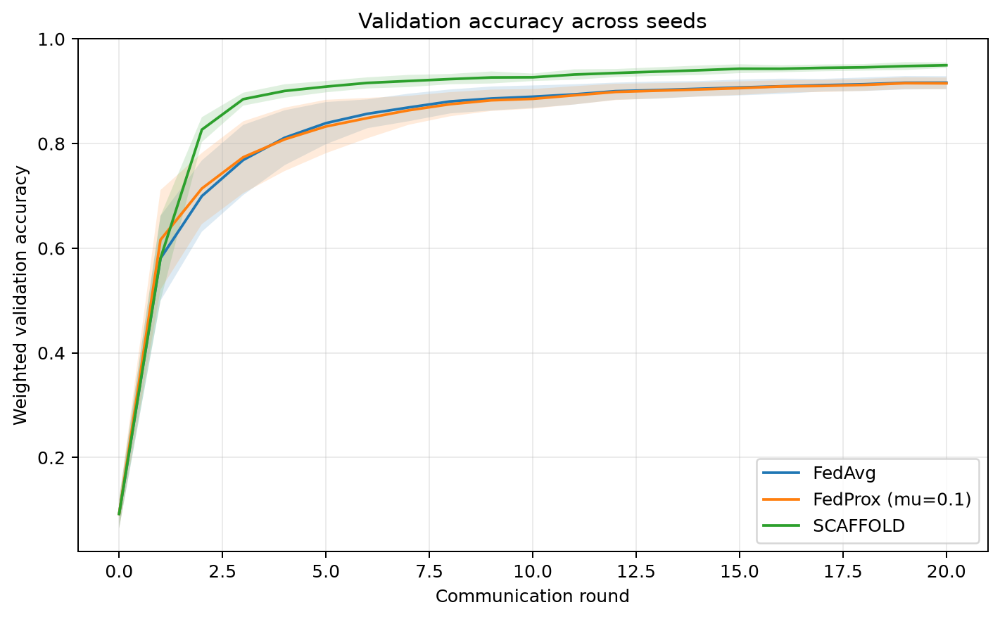
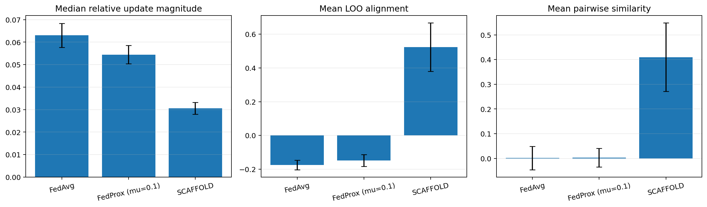

# Federated Optimization Under Statistical Heterogeneity

From-scratch PyTorch implementations of FedAvg, FedProx, and a
sample-size-weighted SCAFFOLD variant, studied under controlled heterogeneous
MNIST partitions.

I started this project because I did not want to treat federated learning
algorithms as black boxes or judge them only by final accuracy. My initial
intuition was that client drift might be controlled by limiting how far each
client moves from the global model. That led me from FedAvg to FedProx, and then
to measuring the client updates themselves: their magnitude, their directional
agreement, and how much they reinforce or cancel one another.

The multi-seed results changed my understanding. FedProx reliably made updates
smaller, but that did not reliably improve the global model. I therefore
implemented SCAFFOLD to test a different idea: correcting client-specific drift
instead of only restricting local movement.

Here, “from scratch” means that the federated optimization logic is implemented
directly in PyTorch without Flower, TensorFlow Federated, or another federated
learning framework.

## Research question

> Under strong statistical heterogeneity, is constraining local deviation
> enough to improve federated optimization, or is explicitly correcting client
> drift more effective?

I compare three approaches:

- **FedAvg:** average the clients' locally trained models.
- **FedProx:** add a proximal penalty that keeps local models close to the
  current global model.
- **SCAFFOLD:** maintain server and client control variates that correct
  systematic drift in local gradients.

## Main results

The final comparison uses three matched seeded federated environments. Each
seed determines one client partition, train/validation/test split, initial
model, and minibatch schedule. The seed—not a client or communication round—is
the experimental unit.

| Method | Weighted test accuracy | Macro client accuracy | Worst-client accuracy | Within-seed client SD |
|---|---:|---:|---:|---:|
| FedAvg | 91.74 ± 1.22% | 89.34 ± 3.38% | 82.91 ± 6.93% | 4.45 ± 2.03% |
| FedProx (`mu = 0.1`) | 91.47 ± 1.39% | 89.68 ± 2.96% | 84.87 ± 3.93% | 3.57 ± 0.99% |
| FedProx (`mu = 1.0`) | 87.89 ± 2.02% | 84.34 ± 6.05% | 73.38 ± 14.10% | 6.48 ± 4.31% |
| Weighted SCAFFOLD | **94.87 ± 0.39%** | **94.12 ± 0.76%** | **90.92 ± 1.07%** | **2.24 ± 0.55%** |

Values are mean ± sample standard deviation across `n = 3` seeds. “Macro”
gives each client equal weight; weighted accuracy gives each held-out example
equal weight. The within-seed client SD measures dispersion across the five
client accuracies and is then summarized across seeds.



### What I conclude from these results

1. **FedProx changed the optimization geometry more consistently than it
   changed performance.** With `mu = 0.1`, median relative update magnitude
   decreased in all three seeds, by 13.6% on average. Leave-one-out alignment
   also became less negative in all three seeds. However, weighted test
   accuracy improved in only one of the three seeds.

2. **A smaller update is not necessarily a better update.** Strong FedProx
   (`mu = 1.0`) contracted updates even further but substantially reduced
   weighted, macro, and worst-client accuracy. Constraining local movement can
   suppress useful learning as well as harmful drift.

3. **Direct drift correction was more effective in this setting.** Weighted
   SCAFFOLD improved weighted accuracy relative to FedAvg in all three seeds.
   Its mean leave-one-out alignment changed from `-0.175` under FedAvg to
   `+0.523`, while mean pairwise similarity changed from approximately zero to
   `0.410`. This is consistent with client updates reinforcing one another more
   often instead of cancelling.

4. **The improvement has a cost.** Under the full-vector accounting used here,
   SCAFFOLD increases modeled communication from 4.07 MB to 8.14 MB per round
   and adds 2.44 MB of control state across the server and five clients.

These are descriptive results from three seeds, not evidence that SCAFFOLD is
universally better. They show what happened in this controlled setting and
motivate a broader evaluation.



## How the methods differ

### FedProx: restrict how far clients move

For client `i`, FedProx optimizes

$$
F_i(w) + \frac{\mu}{2}\lVert w-w_t\rVert_2^2,
$$

where `w_t` is the global model at the beginning of the round. The proximal
term discourages the local model from moving too far from that reference.

### SCAFFOLD: correct where clients move

SCAFFOLD modifies the local gradient as

$$
g_i^{\mathrm{corrected}} = g_i + c - c_i,
$$

where `c` is the server control variate and `c_i` is the persistent control
variate for client `i`. Intuitively, `c_i` remembers the client's characteristic
gradient direction across rounds; the correction removes that local tendency
and adds a shared global reference.

A concise way I think about the difference is:

> FedProx gives clients a speed limit. SCAFFOLD helps calibrate their compasses.

The implementation uses the Option II client-control update

$$
c_i^+ = c_i-c+\frac{x-y_i}{K_i\eta},
$$

where `x-y_i` is the accumulated local descent direction and division by the
number of local steps `K_i` and learning rate `eta` returns it to an average
gradient scale. See [`docs/methodology.md`](docs/methodology.md) for a more
detailed explanation.

## Experimental design

The final Notebook 06–07 comparison keeps the following setup fixed:

| Setting | Value |
|---|---|
| Dataset | MNIST training collection |
| Clients | 5, with full participation |
| Heterogeneity | Dirichlet label partition, `alpha = 0.1` |
| Per-client split | 80% train, 10% validation, 10% held-out test |
| Model | MLP: `784 -> 128 -> 10`, ReLU |
| Optimizer | SGD |
| Learning rate | 0.01 |
| Batch size | 64 |
| Local epochs | 5 |
| Communication rounds | 20 |
| Seeds | 42, 43, 44 |
| FedProx coefficients | `mu in {0.0, 0.1, 1.0}` |
| SCAFFOLD variant | Full participation, sample-size-weighted model and control aggregation |

Within each seed, all method conditions reuse the same partition, client
splits, initial model state, and seeded minibatch schedule. The client-local
test subsets are reserved for final evaluation. The official MNIST test split
is intentionally not used in the final client-level comparison because it has
no federated client identity.

### Why sample-size weighting?

I use sample-size weighting so that each training example contributes equally
to the pooled empirical objective. This is not an assumption that larger
clients are inherently more important or more representative. Because this
objective can still prioritize large clients, I report macro client accuracy,
worst-client accuracy, and cross-client dispersion alongside weighted
accuracy.

## What I measure beyond accuracy

For client update `Delta_i = w_i - w_t`, the main diagnostics are:

| Diagnostic | Question |
|---|---|
| Relative update magnitude | How far did the client move relative to the global model scale? |
| Pairwise cosine similarity | Do two clients move in similar directions? |
| Leave-one-out alignment | Does one client's update agree with the weighted update of all other clients? |

These diagnostics help examine mechanism, but they are not independent
statistical replicates and they do not prove that alignment causes accuracy.

## Notebook progression

The repository keeps the early notebooks because they show how the final
question developed, but the latest conclusions come from Notebooks 06 and 07.

| Notebook | Purpose | Role |
|---|---|---|
| [`01_fedavg_from_scratch.ipynb`](notebooks/01_fedavg_from_scratch.ipynb) | Implement FedAvg and study local epochs under IID data | Foundation |
| [`02_fedavg_shard_noniid.ipynb`](notebooks/02_fedavg_shard_noniid.ipynb) | Introduce pathological shard heterogeneity | Exploratory |
| [`03_fedavg_dirichlet_noniid.ipynb`](notebooks/03_fedavg_dirichlet_noniid.ipynb) | Compare several Dirichlet concentrations | Exploratory |
| [`04_fedprox_under_heterogeneity.ipynb`](notebooks/04_fedprox_under_heterogeneity.ipynb) | Add FedProx and run an initial coefficient sweep | Exploratory |
| [`05_client_update_geometry.ipynb`](notebooks/05_client_update_geometry.ipynb) | Measure magnitude and directional agreement in one seeded environment | Mechanism study |
| [`06_multiseed_fedprox_robustness.ipynb`](notebooks/06_multiseed_fedprox_robustness.ipynb) | Test whether the FedProx finding replicates across matched seeds | Canonical evidence |
| [`07_scaffold_under_heterogeneity.ipynb`](notebooks/07_scaffold_under_heterogeneity.ipynb) | Compare weighted SCAFFOLD with the matched FedAvg and FedProx baselines | Canonical evidence |

For the final evidence, start with Notebooks 06 and 07. Notebook 05 is useful
for understanding why I moved from final accuracy to client-update geometry.

## Repository structure

```text
.
├── src/                              # Federated algorithms and utilities
│   ├── aggregate.py                  # Sample-size-weighted aggregation
│   ├── data.py                       # IID, shard, and Dirichlet partitioning
│   ├── diagnostics.py                # Update vectorization and geometry
│   ├── experiment.py                 # Matched FedAvg/FedProx runner
│   ├── fedprox.py                    # FedProx local objective
│   └── scaffold.py                   # Weighted SCAFFOLD and diagnostics
├── notebooks/                        # Seven experiments in research order
├── results/
│   ├── client_update_geometry/       # Notebook 05 artifacts
│   ├── multiseed_fedprox/            # Notebook 06 artifacts
│   └── scaffold_under_heterogeneity/ # Notebook 07 artifacts
├── docs/methodology.md               # Mathematical and design explanation
└── tests/test_scaffold_invariants.py # Small deterministic correctness checks
```

See [`results/README.md`](results/README.md) for the artifact map and column
definitions, and [`notebooks/README.md`](notebooks/README.md) for execution
guidance.

## Inspecting or reproducing the study

```bash
git clone https://github.com/khanhhuyenpham/federated-learning-under-heterogeneity.git
cd federated-learning-under-heterogeneity

python -m venv .venv

# Windows PowerShell
.venv\Scripts\Activate.ps1

# macOS/Linux
source .venv/bin/activate

python -m pip install --upgrade pip
python -m pip install -r requirements.txt
python -m pip install -r requirements-dev.txt
python -m pytest -q
jupyter lab
```

The canonical CSV files and figures are committed, so the analysis can be
inspected without repeating the training runs. Expensive execution flags are
disabled by default in the published notebooks. Use the restart-safe loaders
in Notebooks 05–07 to regenerate tables and figures from the saved artifacts.

The completed multi-seed experiments were run on Kaggle with Python 3.12.13,
PyTorch 2.10.0+cu128, and one NVIDIA T4. A single seed-condition took roughly
18 minutes in the baseline experiment, so a complete multi-seed sweep takes
hours rather than minutes. Exact floating-point reproduction can still vary
with hardware and backend behavior.

## Correctness checks

The lightweight test suite checks identities that are central to the
implementation:

- With zero control variates and matched batches, the first SCAFFOLD local
  update matches FedAvg.
- The Option II client-control update matches its closed-form expression on a
  deterministic toy model.
- Under full participation, the server control is consistent with the weighted
  client controls.
- Vectorized weighted aggregation matches parameter-wise aggregation.

These tests run on synthetic data and do not download MNIST or launch a full
federated experiment.

## Limitations

- The study uses MNIST and a small MLP; it does not establish behavior on
  harder datasets or architectures.
- Only three seeded federated environments, five clients, one Dirichlet
  concentration, and one local-training regime are evaluated.
- All clients participate in every round. Client dropout and system
  heterogeneity are not modeled.
- The client-local held-out sets are derived from the MNIST training
  collection, so they do not test transfer to a new dataset or deployment.
- Small client test sets make worst-client accuracy volatile, especially in
  the most imbalanced partition.
- This is a sample-size-weighted SCAFFOLD variant; other weighting rules may
  optimize a different client-level objective.
- Communication values count full model and control vectors but exclude
  protocol overhead, compression, and secure aggregation.
- Update geometry is mechanistically informative but does not independently
  prove why a method improved accuracy.

## What I would test next

The next controlled experiment should change one factor at a time. I would
first replace the MLP with a small CNN while reusing the saved client worlds,
then expand to more clients, partial participation, and additional forms of
heterogeneity. I would also compare communication required to reach a target
accuracy rather than only communication over a fixed 20-round budget.

## References

- McMahan et al., [Communication-Efficient Learning of Deep Networks from
  Decentralized Data](https://proceedings.mlr.press/v54/mcmahan17a.html),
  AISTATS 2017.
- Li et al., [Federated Optimization in Heterogeneous
  Networks](https://arxiv.org/abs/1812.06127), MLSys 2020.
- Karimireddy et al., [SCAFFOLD: Stochastic Controlled Averaging for Federated
  Learning](https://proceedings.mlr.press/v119/karimireddy20a.html), ICML 2020.

## License

This project is available under the [MIT License](LICENSE).

