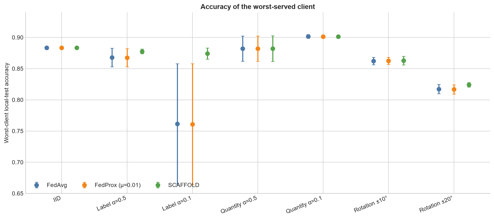
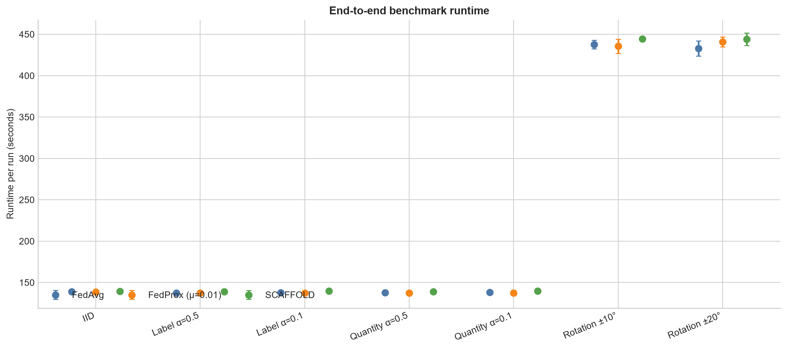

# Balanced Benchmark v1

## Research objective

This folder contains the compact final outputs for the MNIST benchmark
comparing FedAvg, FedProx, and SCAFFOLD under controlled federated
heterogeneity. The objective is to test whether algorithm behavior depends on
the type of heterogeneity, not only on its severity.

Accuracy values are mean ± sample standard deviation across three seeds unless
otherwise stated. The full per-run archives are distributed separately as
release assets.

## Fixed experimental protocol

| Setting | Value |
|---|---|
| Dataset | MNIST |
| Model | `SimpleMLP(784 -> 128 -> 10)` |
| Clients | 5, full participation |
| Communication rounds | 20 |
| Local epochs | 1 |
| Learning rate | 0.01 |
| Batch size | 64 |
| Seeds | 42, 43, 44 |
| FedAvg | `mu = 0` |
| FedProx | `mu = 0.01` |
| SCAFFOLD | `mu = None` |

The FedProx pilot archive records source commit
`644b4a53c0a4bfd2e1dbbdaef83e2f695db09e49`. Notebook 09 pins main benchmark
execution to source commit `fd2b045544297350d3bbe4a44a81f1a49392d2cb`.

## Condition matrix

| Family | Conditions |
|---|---|
| Reference | IID |
| Label skew | `alpha = 0.5`, `alpha = 0.1` |
| Quantity skew | `alpha = 0.5`, `alpha = 0.1`, minimum 100 samples/client |
| Rotation shift | maximum absolute rotation 10° and 20° |

This gives 7 conditions × 3 seeds × 3 algorithms = 63 runs.

## FedProx μ-selection reference

FedProx `mu = 0.01` was selected before the main benchmark in
[`../../notebooks/08_fedprox_mu_selection.ipynb`](../../notebooks/08_fedprox_mu_selection.ipynb).
The pilot evaluated `mu in {0.01, 0.1, 1.0}` under label skew `alpha = 0.1`
for seeds 42, 43, and 44. The selection score was mean validation accuracy over
rounds 16-20, with a 0.0025 tolerance, lower across-seed standard deviation as
the stability tie-break, and smaller `mu` as the final deterministic tie-break.

The recomputed pilot means were `0.845022` for `mu = 0.01`, `0.842967` for
`mu = 0.1`, and `0.822489` for `mu = 1.0`.

## Main cross-seed results

Clean global-test accuracy:

| Condition | FedAvg | FedProx (`mu=0.01`) | SCAFFOLD |
|---|---:|---:|---:|
| IID | 0.9047 ± 0.0009 | 0.9046 ± 0.0008 | 0.9048 ± 0.0008 |
| Label α=0.5 | 0.8957 ± 0.0022 | 0.8957 ± 0.0022 | 0.9034 ± 0.0013 |
| Label α=0.1 | 0.8603 ± 0.0261 | 0.8599 ± 0.0264 | 0.9014 ± 0.0015 |
| Quantity α=0.5 | 0.9209 ± 0.0065 | 0.9207 ± 0.0061 | 0.9212 ± 0.0064 |
| Quantity α=0.1 | 0.9294 ± 0.0078 | 0.9289 ± 0.0077 | 0.9295 ± 0.0078 |
| Rotation ±10° | 0.9026 ± 0.0017 | 0.9025 ± 0.0017 | 0.9027 ± 0.0016 |
| Rotation ±20° | 0.8942 ± 0.0006 | 0.8939 ± 0.0008 | 0.8925 ± 0.0013 |

## Client-level fairness findings

Under label skew `alpha = 0.1`, SCAFFOLD improved the mean worst-client local
test accuracy from `0.7614 ± 0.0965` with FedAvg and `0.7608 ± 0.0969` with
FedProx to `0.8742 ± 0.0090`. The within-seed client accuracy standard
deviation was also lower: `0.0190 ± 0.0020` for SCAFFOLD versus
`0.0536 ± 0.0319` for FedAvg and `0.0537 ± 0.0319` for FedProx.

## Rotation global/local trade-off

Rotation ±20° separates clean global transfer from service to the rotated
clients:

| Algorithm | Clean global | Local weighted | Worst client |
|---|---:|---:|---:|
| FedAvg | 0.8942 | 0.8564 | 0.8172 |
| FedProx (`mu=0.01`) | 0.8939 | 0.8561 | 0.8167 |
| SCAFFOLD | 0.8925 | 0.8594 | 0.8242 |

SCAFFOLD slightly reduces clean global-test accuracy here while slightly
improving local weighted and worst-client accuracy.

## Runtime summary

Mean runtime per run across all 21 condition-seed pairs was `222.9 ± 137.6`
seconds for FedAvg, `223.5 ± 139.2` seconds for FedProx, and `226.4 ± 141.2`
seconds for SCAFFOLD. The standard deviations reflect both condition and seed
differences; they are large because rotation transforms change data-loading
cost across conditions. Within this implementation, SCAFFOLD's runtime overhead
is modest.

## Supported conclusions

1. SCAFFOLD's clearest advantage occurs under label skew, especially
   `alpha = 0.1`.
2. Under label skew `alpha = 0.1`, SCAFFOLD also has substantially lower
   seed-to-seed variation.
3. FedProx with the pilot-selected `mu = 0.01` is practically equivalent to
   FedAvg under this fixed protocol.
4. Under IID, quantity skew, and mild rotation, algorithm differences are
   small.
5. Under rotation ±20°, SCAFFOLD trades slightly lower clean global accuracy
   for slightly better local and worst-client accuracy.
6. The algorithm effect depends on the type of heterogeneity.

## Limitations

- Three seeds support descriptive robustness checks, not formal significance.
- MNIST, five clients, full participation, and a small MLP are not
  production-scale federated learning.
- Only one selected FedProx `mu` is used in the main benchmark.
- Quantity skew preserves the full dataset and uses sample-size-weighted
  aggregation, so it should not be interpreted as universally easier than
  label or feature shift.
- Runtime values are implementation and hardware dependent.

## Folder contents

[`combined/`](combined/) contains the eight analysis-ready CSVs exported by
Notebook 09:

- `summary.csv`
- `validation_by_round.csv`
- `validation_by_client.csv`
- `client_update_diagnostics.csv`
- `pairwise_update_diagnostics.csv`
- `round_diagnostics.csv`
- `local_test_by_client.csv`
- `condition_preflight.csv`

[`analysis/tables/`](analysis/tables/) contains six compact derived tables:

- [`global_accuracy_mean_sd.csv`](analysis/tables/global_accuracy_mean_sd.csv)
- [`paired_global_differences.csv`](analysis/tables/paired_global_differences.csv)
- [`realized_heterogeneity.csv`](analysis/tables/realized_heterogeneity.csv)
- [`rotation_20_tradeoff.csv`](analysis/tables/rotation_20_tradeoff.csv)
- [`runtime_summary.csv`](analysis/tables/runtime_summary.csv)
- [`tail_validation_summary.csv`](analysis/tables/tail_validation_summary.csv)

[`analysis/figures/`](analysis/figures/) contains seven final figures:

- [`global_accuracy_by_condition.png`](analysis/figures/global_accuracy_by_condition.png)
- [`label_skew_0p1_convergence.png`](analysis/figures/label_skew_0p1_convergence.png)
- [`label_skew_0p1_pairwise_alignment.png`](analysis/figures/label_skew_0p1_pairwise_alignment.png)
- [`local_weighted_accuracy_by_condition.png`](analysis/figures/local_weighted_accuracy_by_condition.png)
- [`runtime_by_condition.png`](analysis/figures/runtime_by_condition.png)
- [`strong_label_skew_seed_robustness.png`](analysis/figures/strong_label_skew_seed_robustness.png)
- [`worst_client_accuracy_by_condition.png`](analysis/figures/worst_client_accuracy_by_condition.png)

## Reproduction instructions

1. Run Notebook 08 to validate the FedProx pilot archive and selected `mu`.
2. Run Notebook 09 on Kaggle GPU to restore or reproduce the fixed 63-run
   benchmark. Its no-retraining safety gate refuses to launch missing runs when
   restoring a complete archive.
3. Run Notebook 10 to rebuild the final figures and compact analysis tables
   from the completed archive's combined CSVs.

The complete raw archives are intentionally not normal repository files. Attach
these release assets when full per-run audit material is needed:

- `fedprox_mu_pilot_v1_complete.zip`
- `balanced_benchmark_v1_complete.zip`
